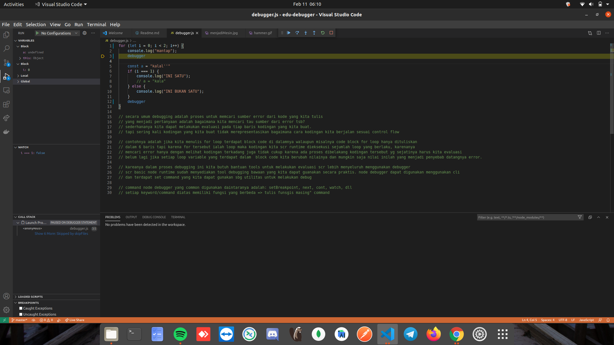
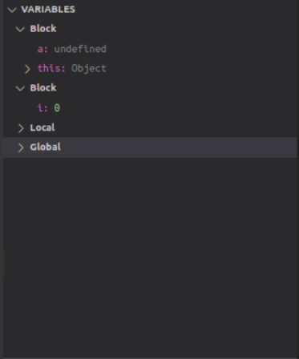
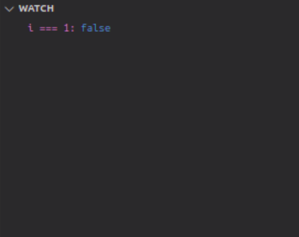

## Table of Content
1. [Prelude What is error?](#prelude-what-is-error)
1. [Types of program errors](#types-of-program-errors)
1. [Errors in Javascript](#error-in-javascript )
1. [How do we solve that?](#how-do-we-solve-that)
1. [The Debugger](#the-debugger)
1. [Let's get our hand dirty](#let's-get-our-hand-dirty)
1. [References](#references)

## Prelude what is error?
Pada phase 0 kita telah banyak melakukan koding program mulai dari membuat laman html sederhana hingga memecahkan masalah menggunakan bahasa pemrogramman. Dalam setiap pratik koding tentu kita tidak terlepas dari kesalahan. Mungkin sebelumnya kita sembat bertemu dengan beberapa masalah seperti kode tidak dapat berjalan, program tidak menghasilkan output yang semestinya dan banyak lagi. Hal-hal inilah yang kita biasa disebut error.

## Types of program errors
Error dalam dunia programman dapat diklasifikasikan menjadi beberapa tipe:
* ***syntax errors*** => sitanks error adalah jenis error yang mana sangat berkaitan erat dengan cara penulisan sebuah bahasa pemrogramman dimana penulisan kode kita tidak sesuai dengan apa yang telah bahasa pemromgramman tentukan. contoh:
```javascript
cnts nama = "diaz" /*cnts secara aturan salah karena konstan 
direpresentasikan oleh const pada javascript*/
const obj = { nama: "diaz" /* error karena untuk deklarasi object 
didefinisikan menggunakan kurung kurawal buka dan kurung kurawal tutup.*/
```
* ***semantic errors*** => semantik error adalah jenis error yang mana secara aturan atau keyword yang berlaku sudah sesuai hanya saja penggunaannya tidak tepat.
contoh: 
```javascript
const pi = 3.14
pi = 200 /* error terjadi karena pi dideklarasikan sebagai konstanta 
akan tetapi pada baris selanjutanya pi direassign dengan nilai baru.*/
```
```javascript

const person = {
    name: null
}
console.log(person.name.firstName); /*error terjadi karena dalam key(name) 
tidak terdapat sebuah objek yang memiliki key(firstName)*/
```
```javascript
const person = {
    name: {
        firstName: "Joni",
        lastName: "dudung"
    }
}
console.log(person.name.firstName); // contoh yang benar
```
* ***logical errors*** => logical error adalah jenis error yang sebenarnya lebih dari cara kita berfikir karena secara penulisan kodingan tidak ada masalah tapi output dari program yang kita buat tidak sesuai dengan yang diinginkan.
```javascript
function penambahan(num1, num2) {
    return num1 - num2
}
const result = penambahan(23, 9)
console.log(result) /*ouput seharusnya adalah 32 akan tetapi fungsi 
mengeluarkan nilai 14, hal ini salah karena pada fungsi penambahan 
kita menulis minus(-) seharusnya (+)*/
```
```javascript
for (let i = 0; i < 100; i--) {
    console.log(i)
} // infinity loop
```

Dari sudut pandang bagaimana mesin mendeteksi error pada kodingan, error dapat dibedakan menjadi beberapa jenis:
* ***compile time errors*** => error ini adalah error dimana terjadi sebelum program dijalankan atau pada proses kompilasi kode. Compile time error dapat diindikasikan juga jika di kodingan kita terjadi sytax atau semantic error.
* ***run time errors*** => error ini terjadi pada saat aplikasi dijalankan dimana terdapat perubahan data yang mana data ini menyebabkan mesin program(runtime) tidak dapat berjalan.
```javascript
let str = "ini string"
for (let i = 0; i < 3; i++) {
    console.log("loop ke: ", i);
    if (i === 1) {
        str = null
    } else {
        console.log("ini jmlh karakter str: ", str.length);
    }    
} /* kode di atas akan terjadi error ketika data string berubah 
pada kondisi i = 1 nilai dari string tersebut berubah menjadi null 
sementara pada kondisi else kita menggunakan properti length sementara 
variable str sudah berubah manjadi null padahal properti ini hanya 
dimiliki jika variable bertipe string/array */
```
## Errors in Javascript
Javascript dapat mendeteksi error dan menghasilkan pesan yang cukup jelas dan dapat dimengerti, error-error tersebut dapat kita list diantaranya adalah:
* ***ReferenceError*** => error yang terjadi ketika kita memanggil variable yang tidak pernah di deklarasi. contoh:
```javascript
function foo() { 
  'use strict'; 
  bar = true; //variable bar tidak pernah dideklarasi
} 
foo(); // ReferenceError: bar is not defined
```
* ***Unexpected token*** => error yang dihasilkan karena terdapat sintaks yang tidak sesuai dengan kaidah penulisan kode bisa karena adanya penambahan karakter yang berkaitan dengan sintaks atau kurang. contoh karakter ***( { , ( , ; )***
```javascript
for (let i = 0;; i < 5; i++) {
    console.log(i)
} // error terjadi karena ada penambahan karakter ; 
```
* ***Unexpected identifier*** => error yang terjadi karena kesalahan sintak karena ada sisipan tambahan dari karakter selain karakter yang berkaitan dengan sintaks.
```javascript
let a = 'saya'
if s (a === 'saya) {
    console.log(a)
} /*error terjadi karena setelah sintaks if tidak langsung dilanjutkan 
dengan token { } tapi ada sisipan karakter lain*/
```


## How do we solve that?
Seletah melihat tipe-tipe error diatas sekarang yang menjadi pertanyaan besar adalah gimana sih cara kita menyelesaikan error-error tersebut?


Mugkin beberapa dari kita sudah pernah menontoh kartun spongebob. Nah episode diatas spongebob memberitahu squidward jika ingin memenagkan game di atas adalah dengan caranya ***MENJADI MESIN***. Ini sebenarnya adalah konsep yang sangat bagus dan dapat diimplementasikan juga ketika kita ingin menyelesaikan error pada kodingan kita.

Sederhananya adalah kita harus bisa berfikir bagaimana mesin mengeksekusi program yang kita buat, mulai dari bagaimana control flow (mesin membaca kodingan satu persatu baris kode dari atas ke bawah) bekerja, bagaimana setiap operasi dieksekusi, apa saja perubahan data yang terjadi ketika kita menjalankan program, dll.

Mungkin kadang kita menemui kesulitan ketika mencari error dengan meruntut kode dari atas sampai bawah dan terkadang kode yang kita tulis dieksekusi tidak seperti apa yang kita pikirkan. Disinilah kita membutuhkan bala bantuan sebuah tools magic yaitu ***DEBUGGER***.

## The Debugger
Sang magic telah datang!!!
oke sekarang kita mendegar istilah baru lagi, debugger. Kalau sebelumnya kita biasa menyebut kesalahan program itu error pada dunia koding error ini biasa kita sebut bug dan cara kita menghilangkan bug ini dengan cara BELI BAYGOOONNN!!!, gak gak gak bercanda cara kita untuk menghilangkan bug biasa dinamakan debugging dan alat yang digunakan adalah debugger.


Debugger berfungsi untuk membantu programmer untuk melakukan tracing pada kode yang dijalankan. tracing meliputi evaluasi control flow, monitoring perubahan data, dan masih banyak lagi fitur-fitur bermanfaat lainnya.

Debugger pada javascript memiliki beberapa tipe diantaranya:
* built-in node debugger
* third party debugeer
* IDE debugeer

untuk kali ini kita akan membahas 2 yang biasa saya gunakan, built-in debugger dan IDE debugger.

* ***Built-in debugger*** => adalah jenis debugger  yang kita bisa langsung gunakan jika kita sudah menginstall node runtime. Simplenya karna itu built-in/bawaan. built-in menawarkan antar muka berupa CLI (command line interface) untuk mengoperasikannya.
Berikut adalah beberapa command yang dapat digunakan pada built-in debugger:

1. cont, c : melanjutkan eksekusi
2. next, n : melakukan eksekusi program per operasi
3. watch('expr') : menambah sebuah expresi (bisa variabel, bisa kondisi, dll) untuk kita pantau perubahannya
4. setBreakpoint : membuat breakpoint atau titik berhenti pada salah satu baris kode
5. repl : membuka prompt atau CLI interface REPL node agar kita bisa lebih leluasa membuat expressi hanya saja repl disini menggunakan konteks program yang sedang dijalankan, jadi kita bisa memanggil variable atau function yang sedang kita debug di sini.

Untuk menggunakan debugger ini kita dapat dengan mudah menuliskan argumen ***inspect*** pada saat menjalankan kode program.
```shell
node inspect my_code.js
```
setelah menjalankan kode diatas maka akan keluar sebuah prompt seperti di bawah:
```shell
< Debugger listening on ws://127.0.0.1:9229/4262a42e-6f07-459a-9eb0-3dd18b157882
< For help, see: https://nodejs.org/en/docs/inspector
< Debugger attached.
< Waiting for the debugger to disconnect...
debug>
```
setelah itu kalian dapat menggunakan command-command di atas untuk melakukan debugging. contoh penggunaan command pada file debugger.js:
1. ***cont*** => program akan jalan dari atas hingga bawah jika tidak terdapat breakpoint
```shell
Break on start in debugger.js:1
> 1 for (let i = 0; i < 6; i++) {
  2     let num = null
  3     if (i === 1) {
debug> cont
< INI BUKAN SATU
< INI SATU
< INI BUKAN SATU
< INI BUKAN SATU
< INI BUKAN SATU
< INI BUKAN SATU
< Waiting for the debugger to disconnect...
```
2. ***setBreakpoint(5)*** => membuat break point pada baris ke 5 file debugger.js, hal ini akan membuat program berhenti pada baris ke 5 ketika menggunakan perintah cont ataupun next
```shell
Break on start in debugger.js:1
> 1 for (let i = 0; i < 6; i++) {
  2     let num = null
  3     if (i === 1) {
debug> setBreakpoint(5)
  1 for (let i = 0; i < 6; i++) {
  2     let num = null
  3     if (i === 1) {
  4         num = 1
> 5         console.log("INI SATU");
  6     } else {
  7         console.log("INI BUKAN SATU");
  8     }
  9 }
debug> cont
< INI BUKAN SATU
break in debugger.js:5
  3     if (i === 1) {
  4         num = 1
> 5         console.log("INI SATU");
  6     } else {
  7         console.log("INI BUKAN SATU");
debug> cont
< INI SATU
< INI BUKAN SATU
< INI BUKAN SATU
< INI BUKAN SATU
< INI BUKAN SATU
< Waiting for the debugger to disconnect...
```
jika dilihat dari gambar di atas ketika kita setBreakpoint(5) maka console akan menampilkan baris ke 5 program kita, lalu kita tulis cont lagi makan program akan jalan dan pada iterasi ke 2 program berhenti karena baris 5 dieksekusi setelah dipasangkan breakpoint, jika kita input lagi cont maka program akan jalan lagi sampai akhir karena baris ke 5 hanya dieksekusi sekali.

3. ***next***
```shell
Break on start in debugger.js:1
> 1 for (let i = 0; i < 6; i++) {
  2     let num = null
  3     if (i === 1) {
debug> next
break in debugger.js:1
> 1 for (let i = 0; i < 6; i++) {
  2     let num = null
  3     if (i === 1) {
debug> next
break in debugger.js:2
  1 for (let i = 0; i < 6; i++) {
> 2     let num = null
  3     if (i === 1) {
  4         num = 1
debug> next
break in debugger.js:3
  1 for (let i = 0; i < 6; i++) {
  2     let num = null
> 3     if (i === 1) {
  4         num = 1
  5         console.log("INI SATU");
debug> 
```
pada perintah next yang pertama akan muncul kode program dan panah (>) pada barisnya yang menandakan program dieksekusi pada baris tersebut jika kita terus memberikan perintah next maka tanda panah akan terus turun sesuai dengan bagaimana program dieksekusi.

4. ***watch***
```shell
Break on start in debugger.js:1
> 1 for (let i = 0; i < 6; i++) {
  2     let num = null
  3     if (i === 1) {
debug> watch('i == 1')
debug> next
break in debugger.js:1
Watchers:
  0: i == 1 = false

> 1 for (let i = 0; i < 6; i++) {
  2     let num = null
  3     if (i === 1) {
debug> 
break in debugger.js:2
Watchers:
  0: i == 1 = false

  1 for (let i = 0; i < 6; i++) {
> 2     let num = null
  3     if (i === 1) {
  4         num = 1
debug> next
break in debugger.js:3
Watchers:
  0: i == 1 = false

  1 for (let i = 0; i < 6; i++) {
  2     let num = null
> 3     if (i === 1) {
  4         num = 1
  5         console.log("INI SATU");
debug> next
break in debugger.js:7
Watchers:
  0: i == 1 = false

  5         console.log("INI SATU");
  6     } else {
> 7         console.log("INI BUKAN SATU");
  8     }
  9 }
debug> next
< INI BUKAN SATU
break in debugger.js:1
Watchers:
  0: i == 1 = false

> 1 for (let i = 0; i < 6; i++) {
  2     let num = null
  3     if (i === 1) {
debug> next
break in debugger.js:1
Watchers:
  0: i == 1 = true

> 1 for (let i = 0; i < 6; i++) {
  2     let num = null
  3     if (i === 1) {
```
pada program diatas saya menggunakan next untuk melakukan monitoring pada expr 'i === 1' untuk melihat pada setiap baris yang dieksekusi apakah ada perubahan hasil dari expr tersebut. Dapat dilihat juga setelah kita berikan perintah next maka akan ada informasi watchers, disinilah list expr kita dan hasilnya dapat dimonitoring. Perintah terakhir next menunjukan iterasi ke 2 program yang mana nilai i berubah jadi 1 dan expr dievaluasi menjadi true.

5. ***repl***
```shell
Break on start in debugger.js:1
> 1 for (let i = 0; i < 6; i++) {
  2     let num = null
  3     if (i === 1) {
debug> next
break in debugger.js:1
> 1 for (let i = 0; i < 6; i++) {
  2     let num = null
  3     if (i === 1) {
debug> repl
Press Ctrl + C to leave debug repl
> i
0
```
repl pada debugger hampir mirip cara kerjanya dengan console pada web browser, kita dapat memanggil variable juga method yang berbeda adalah kita dapat menggunakan variable pada program yang sedang kita eksekusi. Fitur ini juga memudahkan kita untuk berkreasi dengan menambahkan operasi matematika lain untuk variable pada program yang sedang dieksekusi hanya saya perubahan nilai pada variable tidak memengaruhi program yang sedang dieksekusi, contohnya jika kita ubah nilai i pada repl maka setelah kembali ke prompt(CLI) debugger lalu kita cont eksekusi maka i tetap berjalan dari awal tidak dari value 5.

* ***IDE Debugger*** => jenis debugger ini adalah yang paling saya suka, kalian tau kenapa? ***it's GUI !!!***. Ya memang gui menawarkan kenyamanan interaksi yang lebih baik dibanding cli. Let's see how it going.

IDE Debugger yang saya gunakan menggunakan VSCode IDE (client) untuk menjalankan node debuger. Sederhanya ketika kita membuka kode kita, kita dapat menggunakannya dengan cara menekan ***F5*** maka akan terlihat panel seperti berikut:




Jika kita perhatikan terdapat beberapa panel pada window debugger tersebut. Disini yang saya akan highlight hanya beberapa panel saja diantaranya adalah:

1. Variables panel => panel ini berfungsi untuk melihat variable apa saja yang terdapat pada kode yang kita eksekusi dan kita juga dapat melihat perubahan nilai dari tiap variablenya.



2. Watch panel => panel ini berfungsi untuk melihat dan menambah expression yang kita mau evaluasi dan hasil eksekusi dari tiap expressionnya.



3. Debug actions tab => berfungsi sebagai kontrol untuk menjalankan perintah-perintah seperti yang terdapat pada cli contohnya cont, next, stop, dll.


Dan masih manyak lagi fitur yang bisa digunakan pada VSCode, nanti aku bakal kasih referencenya karna bakal gak cukup materinya hehehehe.

## Let's get our hand dirty
Terdapat beberapa file pada repo ini kalian bisa clone dan jalankan satu persatu filenya untuk mengetahui bagaimana error pada js muncul dan juga kalian bisa coba tools debugging cli sesuai dengan contoh yang telah diberikan.

## References
https://www.lambdatest.com/blog/reference-error-javascript

https://developer.mozilla.org/en-US/docs/Web/JavaScript/Reference/Errors/Unexpected_token

https://www.geeksforgeeks.org/difference-between-compile-time-errors-and-runtime-errors

https://www.inf.unibz.it/~calvanese/teaching/06-07-ip/lecture-notes/uni10/node2.html

https://code.visualstudio.com/docs/editor/debugging

https://www.digitalocean.com/community/tutorials/how-to-use-the-node-js-repl

https://nodejs.org/api/debugger.html

https://developer.mozilla.org/en-US/docs/Web/JavaScript/Reference/Global_Objects/Error